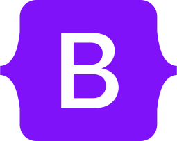
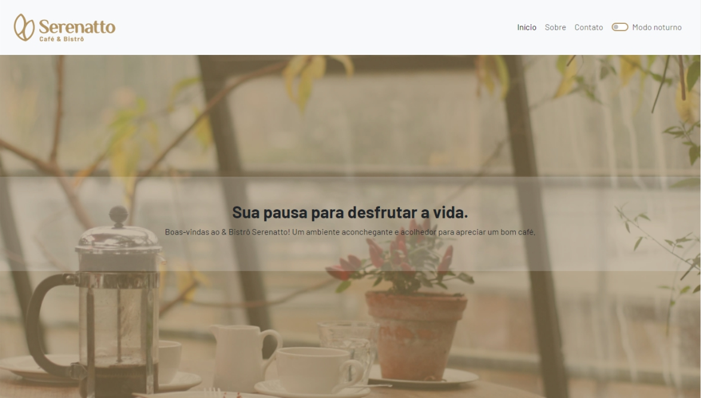
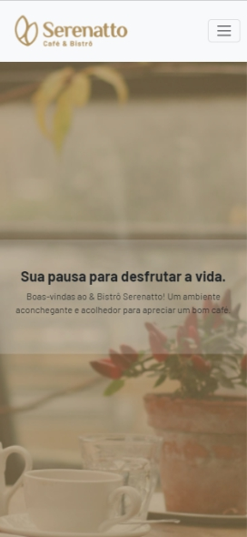

<h1>Projeto Serenatto</h1>

O projeto Serenatto consiste em um Bistrô de Café e delivery estudado e construido em um dos cursos de Bootsrap 5 na Alura. Esse framework CSS consiste em otimizar muito o tempo de produção,  construido principalmente em cima de classes CSS com alguns padrões já estabelecidos mas podendo editalos via arquivo CSS. O projeto consta com opções de Buffet, Bistrô & Café e Delivery. Também com alguns produtos como: Café tradicionais, cafés especiais, vitaminas, pães de diferentes tipos, doces e salgados diversos e finalizando com um formulário para receber ofertas do Bistrô.

<h2>Tecnologias utilizadas</h2>

<h2>Recursos do projeto</h2>

✅ Responsividades: O site foi cuidadosamente projetado para se adaptar de forma fluida a diferentes tamanhos de tela. Isso assegura uma experiência consistente e agradável em dispositivos móveis, tablets e desktops.

✅ Acessibilidade: Foi dada especial atenção à acessibilidade, garantindo que o site seja utilizável por todos os públicos, independentemente de suas habilidades.

<h2> 🖥️ Layout para desktop</h2>

<h2> 📱 Layout para tablet e mobile</h2>

